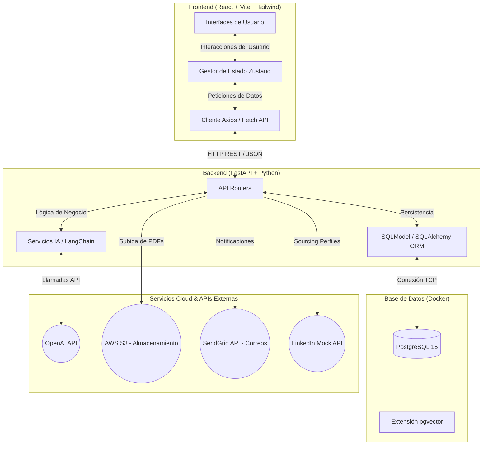
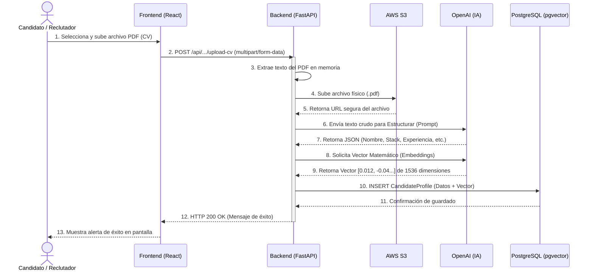

# Arquitectura del Sistema: Plataforma de Reclutamiento Inteligente (PRI MVP)

A continuación se presentan los diagramas UML (Secuencia y Componentes) diseñados específicamente para la arquitectura MVP de tu proyecto de título, reflejando fielmente que **no se utiliza Redis ni Kubernetes**, manteniendo el stack moderno, ligero y altamente funcional.

## 1. Descripción del Proyecto (Alineación para el Informe)

### Resumen del Sistema
La **Plataforma de Reclutamiento Inteligente (PRI)** es una solución de software orientada a resolver la fricción operativa en los procesos de selección de personal. Su objetivo principal es automatizar el filtrado de candidatos y eliminar la captura manual y duplicada de datos utilizando Inteligencia Artificial Generativa y búsquedas vectoriales por similitud semántica.

### Módulos y Funcionalidades Actuales (MVP)
1. **Portal de Candidatos:** Permite a los postulantes subir su Currículum Vitae (PDF). El sistema procesa el documento automáticamente sin requerir llenado manual de formularios tediosos.
2. **Dashboard de Reclutador (Sourcing Avanzado):** 
   - **Ranking de CVs:** Muestra a los candidatos ordenados automáticamente según el porcentaje de "Match" o afinidad semántica con la oferta laboral.
   - **Caza LinkedIn (Sourcing):** Herramienta que permite ingresar la URL de un perfil de LinkedIn, extraer su información profesional en formato estructurado (mediante simulador seguro) e integrarlo instantáneamente a la base de datos de talento.
   - **Carga Masiva:** Permite al reclutador subir múltiples CVs en PDF de forma simultánea. El sistema extrae y clasifica cada documento en bloque mediante IA.
3. **Motor de Inteligencia Artificial:** 
   - **Extracción Estructurada (LLM):** Utiliza OpenAI (GPT-4o-mini) y LangChain para leer texto desestructurado (PDFs) y categorizarlo en: Nombre, Nacionalidad, Stack Tecnológico, Años de Experiencia, Cursos y Resumen de Carrera.
   - **Motor de Similitud Vectorial:** Genera "Embeddings" (vectores de 1536 dimensiones) de los perfiles y los compara matemáticamente usando la extensión `pgvector` de PostgreSQL, logrando búsquedas por contexto (semántica) y no solo por coincidencia exacta de palabras clave.

### Stack Tecnológico Justificado
- **Frontend:** React + TypeScript + Vite + Tailwind CSS. Provee una interfaz moderna, de carga instantánea y componentes reactivos gestionados por Zustand.
- **Backend:** Python + FastAPI. Elegido por su altísimo rendimiento y su estándar en la industria como el mejor ecosistema para integrar herramientas de Inteligencia Artificial (LangChain/OpenAI).
- **Base de Datos:** PostgreSQL 15 + pgvector (mediante SQLModel). Combina la robustez de una base de datos relacional tradicional con las capacidades de vanguardia de una base de datos vectorial para IA en una misma infraestructura.
- **Servicios Cloud:** Integración preparada para AWS S3 (Almacenamiento de archivos PDF) y SendGrid (Notificaciones).

---

## 2. Diagrama de Componentes (Arquitectura General)
Muestra cómo se conectan los grandes bloques del sistema.

---

## 3. Diagrama de Secuencia: Flujo Principal (Carga de CV y Matching)
Muestra el paso a paso ("conversación") desde que se sube un currículum hasta que se guarda como un vector en la base de datos.

## Recomendaciones para la Defensa
- **Justificación de no usar Redis:** En tu defensa puedes mencionar que al ser un MVP enfocado en demostrar el valor del "Vector Matching", la complejidad y sobrecosto de un sistema de caché en memoria como Redis no era justificable para el volumen inicial de datos.
- **Justificación de no usar Kubernetes:** Menciona que el despliegue está pensado inicialmente sobre contenedores simples (Docker Compose o servicios serverless como AWS ECS/AppRunner o Render), manteniendo la agilidad técnica de la startup sin la gigantesca sobrecarga operativa que requiere orquestar Kubernetes (K8s).
