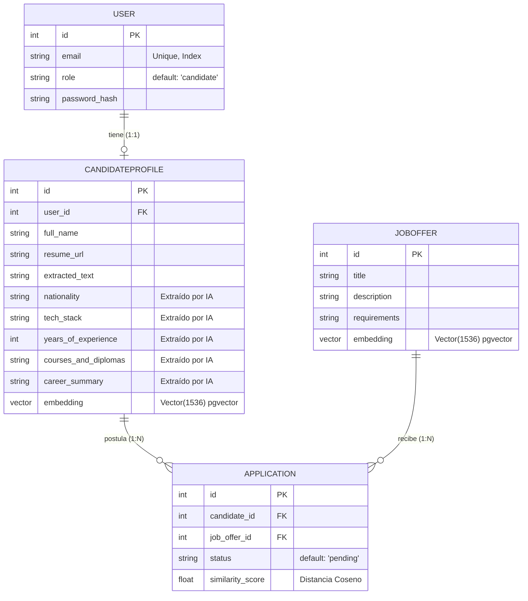

# Diagrama de Base de Datos (PRI MVP)

Este diagrama representa la estructura de las tablas de PostgreSQL (con la extensión pgvector) para la Plataforma de Reclutamiento Inteligente. Puedes utilizar este diagrama para incluirlo directamente en tu informe de título.

## Entidad-Relación (Mermaid)

## Diccionario de Datos Breve

### Tabla `user`
Almacena las credenciales y el tipo de rol de la persona (Candidato o Reclutador).

### Tabla `candidateprofile`
Almacena el perfil profesional. Destacan las columnas extraídas mediante Inteligencia Artificial Generativa (`nationality`, `tech_stack`, `years_of_experience`, `courses_and_diplomas`, `career_summary`) y la columna especial `embedding` que usa **pgvector** para indexar matemáticamente el perfil.

### Tabla `joboffer`
Almacena las ofertas laborales publicadas. Al igual que el perfil del candidato, cuenta con un `embedding` matemático para permitir búsquedas por similitud semántica.

### Tabla `application`
Tabla transaccional o pivote que registra cuando un candidato hace match o postula a una oferta. Guarda el estado del flujo de contratación y el puntaje de similitud (`similarity_score`) calculado por el motor vectorial.
